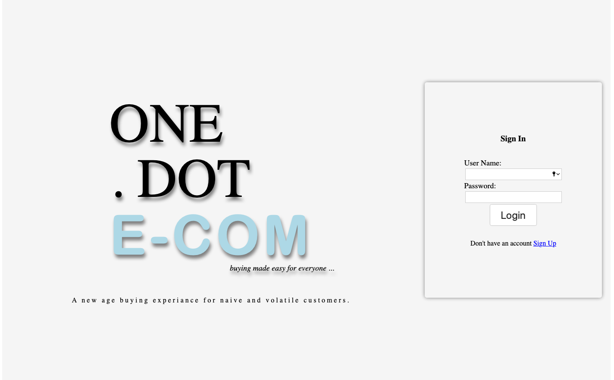
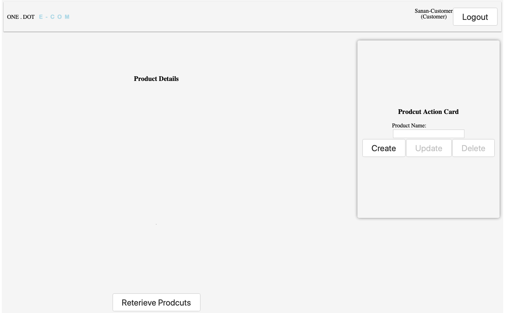

# oneDotECom

Hands On Interview - Fullstack - One Dot E-Com

## Setup and Startup Guide

 ### Database
  
  - MySQL Server
  - Run setup script available at path /Database/setup.sql

 ### API

  - Assign environment values in .env file available at path /API/.env
  - Move to **API** working directory: `cd API`
  - Install packages: `npm install`
  - Start API: `npm start`

 ### Web App

  - Assign environment values in .env file available at path /App/.env
  - Move to **App** working directory: `cd App`
  - Install packages: `npm install`
  - Start App: `npm start`

## Screen Captures

> Landing Page
>  > 

> Home Page
> 

## API

- Base URL: http://localhost/api

  **USER**

  > [POST] /user/register

  **AUTH**

  > [POST] /auth/login
  > [POST] /auth/logout

  **PRODUCTS**

  > [GET] /products - Accessible to all
  >
  > [POST] /products - Accessible to ADMIN | SELLER
  >
  > [PUT] /products - Accessible to ADMIN | SELLER
  >
  > [DELETE] /products/:productId - Accessible to ADMIN | SUPPORTER
